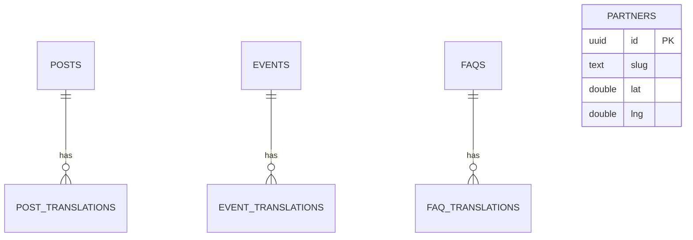

# 🔌 API & Datenmodell

> **Stand: M4 vorbereitet.** Migration-SQL liegt in `supabase/migrations/20260427121400_init.sql`. Cloud-Projekt + `supabase db push` stehen aus (User-Action).

---

## Datenbank-Schema (Postgres / Supabase)

Quelle der Wahrheit: `supabase/migrations/20260427121400_init.sql`. Pattern: Parent-Tabelle mit Lifecycle-Feldern + separate `*_translations`-Tabelle pro Locale.

### Locale-Enum

```sql
create type public.locale as enum ('de', 'en');
```

Identisch zu `routing.locales` aus `src/lib/i18n/routing.ts`. Erweiterung später via `ALTER TYPE locale ADD VALUE 'fr'`.

### Tabellen

| Tabelle | Zweck | Wichtige Felder |
|---|---|---|
| `posts` | Blog-Beiträge (Lifecycle, nicht-übersetzbar) | `slug unique`, `status` (draft/published/archived), `published_at`, `cover_image_url` |
| `post_translations` | Lokalisierte Inhalte je Post | pk `(post_id, locale)`, `title`, `excerpt`, `body_md` |
| `events` | Termine | `slug unique`, `starts_at`, `ends_at`, `location`, `registration_url`, `status` (upcoming/past/cancelled) |
| `event_translations` | Lokalisierte Event-Inhalte | pk `(event_id, locale)`, `title`, `description_md` |
| `faqs` | FAQ-Reihen­folge + Veröffentlichung | `position` (sort), `category`, `is_published` |
| `faq_translations` | Frage + Antwort je Locale | pk `(faq_id, locale)`, `question`, `answer_md` |
| `partners` | Für M5-Partner-Karte | `slug unique`, `name`, `lat`, `lng`, `logo_url`, `website_url`, `status` (partner/pilot/interested) |

### Trigger & Indizes

- `set_updated_at()`-Trigger setzt `updated_at = now()` bei jedem `UPDATE`.
- Indizes:
  - `posts_published_at_idx` partial (`status = 'published'`), absteigend
  - `events_starts_at_idx` absteigend
  - `faqs_position_idx` partial (`is_published = true`)

### RLS

Alle 7 Tabellen haben RLS aktiviert. Public-Read-Policies für `anon, authenticated`:

- `posts`: `select` wenn `status = 'published'`
- `post_translations`: `select` wenn Parent-Post `status = 'published'`
- `events` / `event_translations`: `select` immer (kein „draft"-Status)
- `faqs`: `select` wenn `is_published = true`
- `faq_translations`: `select` wenn Parent-FAQ `is_published = true`
- `partners`: `select` immer

`insert/update/delete` ist nicht freigeschaltet → läuft über `service_role` aus dem Supabase Studio oder über serverseitige Server-Actions mit Service-Role-Key.

### ER-Diagramm



---

## Statisch im Code (kein DB)

- **Ansprechpersonen** (4 Personen) → `src/content/{locale}/team.json`
- **Marketing-Texte** (Projekt-Beschreibung, Standards, Anwendungsbeispiele, Mitwirkung-Steps) → `src/content/{locale}/*.json` (siehe `src/lib/content/loader.ts`)
- **Comic-Strip-Frames** → `src/content/{locale}/landing.json`

---

## Query-Helper

Quelle: `src/lib/supabase/queries.ts`. Alle Funktionen sind async, akzeptieren `Locale`, returnen typisierte Listen mit camelCase-Feldern (Mapping von Postgres-snake_case).

| Funktion | Tabelle | Filter |
|---|---|---|
| `listPublishedPosts(locale)` | posts + post_translations | `status='published'`, sortiert nach `published_at desc` |
| `getPostBySlug(slug, locale)` | posts + post_translations | `status='published'`, `slug=…` (single) |
| `listAllPostSlugs()` | posts | `status='published'`, gibt nur `slug[]` (für `generateStaticParams`) |
| `listUpcomingEvents(locale)` | events + event_translations | `status='upcoming'`, sortiert aufsteigend |
| `listPastEvents(locale)` | events + event_translations | `status='past'`, sortiert absteigend |
| `listPublishedFaqs(locale)` | faqs + faq_translations | `is_published=true`, sortiert nach `position asc` |

i18n-Pattern: `*_translations!inner(...).eq('*_translations.locale', locale)`. Liefert immer auch ohne Translation noch konsistente Strings (Fallback auf `slug`).

`isSupabaseConfigured()` aus `src/lib/supabase/env.ts` ist die zentrale Weiche — Pages bauen ohne `.env.local` weiter und zeigen `<ComingSoonHero>` (siehe ADR-27).

---

## Server Actions (geplant)

### Kontaktformular / Beta-Anmeldung

Server-Action mit Resend (siehe `.env.example: RESEND_API_KEY`). Honeypot + Rate-Limit. Empfänger-Adresse vom User noch offen (siehe PROBLEME.md).

---

## On-Demand Revalidate Webhook

Endpunkt: `src/app/api/revalidate/route.ts`. Methode: `POST`.

**Authentifizierung:** Secret-Vergleich gegen `process.env.REVALIDATE_SECRET` über entweder:
- Query-Parameter `?secret=<value>` (einfach, in Supabase-Webhook-URL einbauen) **oder**
- Header `x-revalidate-secret: <value>` (sauberer, in Webhook-Headers einbauen)

**Body:** Supabase-Webhook-Payload `{ type, table, schema, record, old_record }`. Leerer Body erlaubt → revalidiert alle bekannten Pfade.

**Pfad-Mapping:** Tabelle → Route-File (Pattern matched beide Locales auf einmal):

| Tabelle | revalidatePath-Aufruf |
|---|---|
| `posts`, `post_translations` | `/[locale]/blog` (page) + `/[locale]/blog/[slug]` (page) |
| `events`, `event_translations` | `/[locale]/termine` (page) |
| `faqs`, `faq_translations` | `/[locale]/faq` (page) |

Pages haben `export const revalidate = 60` als Untergrenze für ISR. Webhook setzt sofortige Invalidation; ohne Webhook frischt Next.js die Page einmal pro Minute.

**Status-Codes:**
- `200` mit `{ revalidated: true, paths, ... }` bei Erfolg
- `401` wenn Secret falsch / fehlt
- `500` wenn `REVALIDATE_SECRET` env-var nicht gesetzt ist (defensive Konfiguration)

### Webhook in Supabase Studio einrichten

1. Database → Webhooks → New Hook
2. Tabelle: pro Tabelle einen Hook (oder ein Hook pro relevant Tabelle)
3. Events: `INSERT`, `UPDATE`, `DELETE`
4. URL: `https://<deployment>/api/revalidate?secret=<REVALIDATE_SECRET>`
5. HTTP Method: POST
6. Test: kleines `UPDATE posts SET title = title WHERE …` in einer Translations-Tabelle → `/de/blog` zeigt frische Liste innerhalb < 60 s
