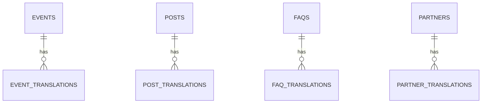

# 🔌 API & Datenmodell

> **Stand: M1.** Supabase-Projekt noch nicht angelegt, Schema noch nicht migriert. Wird in M4 aktiv.

---

## Datenbank-Schema (Postgres / Supabase)

Pattern: Parent-Tabelle für Daten + separate `*_translations`-Tabelle pro Locale.

```sql
create type locale as enum ('de', 'en');

-- Termine ----------------------------------------------------------
create table events (
  id uuid primary key default gen_random_uuid(),
  slug text unique not null,
  starts_at timestamptz not null,
  ends_at timestamptz,
  location text,
  url text,
  type text check (type in ('meetup','workshop','conference','other')),
  published boolean default false,
  created_at timestamptz default now()
);
create table event_translations (
  event_id uuid references events on delete cascade,
  locale locale not null,
  title text not null,
  description text,
  primary key (event_id, locale)
);

-- Blog -------------------------------------------------------------
create table posts (
  id uuid primary key default gen_random_uuid(),
  slug text unique not null,
  cover_image text,
  author text,
  published_at timestamptz,
  status text default 'draft' check (status in ('draft','published')),
  created_at timestamptz default now()
);
create table post_translations (
  post_id uuid references posts on delete cascade,
  locale locale not null,
  title text not null,
  excerpt text,
  body_md text not null,
  primary key (post_id, locale)
);

-- FAQ --------------------------------------------------------------
create table faqs (
  id uuid primary key default gen_random_uuid(),
  category text,
  sort_order int default 0,
  published boolean default true
);
create table faq_translations (
  faq_id uuid references faqs on delete cascade,
  locale locale not null,
  question text not null,
  answer_md text not null,
  primary key (faq_id, locale)
);

-- Partner für Deutschlandkarte ------------------------------------
create table partners (
  id uuid primary key default gen_random_uuid(),
  name text not null,
  short_name text,
  city text not null,
  state text,
  lat numeric(9,6) not null,
  lng numeric(9,6) not null,
  type text check (type in ('theater','webagentur','institution','archiv','other')),
  status text check (status in ('beta-tester','kooperation','interessiert')),
  website text,
  logo_url text,
  published boolean default true
);
create table partner_translations (
  partner_id uuid references partners on delete cascade,
  locale locale not null,
  description text,
  role text,
  primary key (partner_id, locale)
);
```

## ER-Diagramm



## RLS-Policies (Skizze)

- Alle Parent-Tabellen: `select` wenn `published = true`
- Translations: `select` immer
- `insert/update/delete`: nur `service_role`

## Statisch im Code (kein DB)

- **Ansprechpersonen** (4 Personen) → `src/content/{locale}/team.json`
- **Marketing-Texte** (Standards, Anwendungsbeispiele) → `src/content/{locale}/*.mdx`

---

## Server Actions (Skizze, M3+)

### Kontaktformular (`src/components/forms/ContactForm.tsx`)

```ts
'use server';

import { Resend } from 'resend';

const resend = new Resend(process.env.RESEND_API_KEY!);

export async function submitContactForm(formData: FormData) {
  const name = formData.get('name')?.toString().trim();
  const email = formData.get('email')?.toString().trim();
  const message = formData.get('message')?.toString().trim();
  // Validation, Honeypot, Rate-Limit etc.
  await resend.emails.send({
    from: 'website@smarte-theaterdienste.de',
    to: '...',
    subject: `Anfrage von ${name}`,
    text: message,
  });
}
```

---

## On-Demand Revalidate Webhook (M4)

`src/app/api/revalidate/route.ts`:

```ts
import { revalidateTag } from 'next/cache';
import { NextRequest, NextResponse } from 'next/server';

export async function POST(req: NextRequest) {
  const secret = req.headers.get('x-secret');
  if (secret !== process.env.REVALIDATE_SECRET) {
    return NextResponse.json({ ok: false }, { status: 401 });
  }
  const { table } = await req.json();
  // Map Tabelle → Tag
  const tagMap = {
    posts: 'posts',
    events: 'events',
    faqs: 'faqs',
    partners: 'partners',
  } as const;
  const tag = tagMap[table as keyof typeof tagMap];
  if (tag) revalidateTag(tag, 'max');   // Next.js 16: Profile-Argument!
  return NextResponse.json({ ok: true });
}
```

In Supabase: Webhook auf `INSERT/UPDATE/DELETE` der relevanten Tabellen → `https://<deploy>/api/revalidate` mit `x-secret`-Header.
