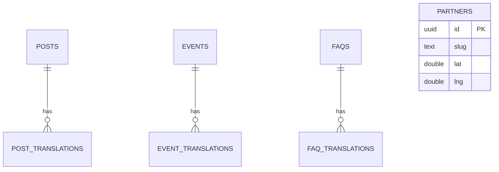

# 🔌 API & Datenmodell

> **Historischer Supabase-Stand.** Das Cloud-Projekt `hyirpaloozcautcxhbqk` existiert seit Session 39 nicht mehr (DNS NXDOMAIN). Schema, Migrationen, Seed und Query-Dokumentation bleiben die Importquelle für M19. Ziel: Inhalte nach Sanity migrieren und die Supabase-Runtime erst nach vollständiger Parität entfernen. Siehe [[SANITY_CMS_PLAN]] + [[ENTSCHEIDUNGEN#ADR-65]].

## M19-Zielzustand: Sanity statt Supabase-Runtime

- `posts` + `post_translations` → Sanity-Dokument `post`
- `events` + `event_translations` → Sanity-Dokument `event`
- `faqs` + `faq_translations` → `faqItem` + Referenz auf `faqCategory` (die 21 aktuellen Einträge liegen bereits zusätzlich in JSON)
- `partners` → Sanity-Dokument `partner`
- JSON-Seiteninhalte → feste Sanity-Singletons und strukturierte Objekte
- UI-Labels/SEO → `siteSettings`

DE/EN werden im Zielmodell gemeinsam pro Inhalt gepflegt; gewöhnliche Dokumente erhalten Sanity-generierte IDs, importierte Supabase-IDs bei Bedarf ein explizites `legacyId`/`sourceKey`. Die SQL-Dateien bleiben bis nach dem Produktions-Cutover unverändert als prüfbare Migrationsquelle erhalten.

---

## Datenbank-Schema (Postgres / Supabase)

Quelle der Wahrheit für das Schema: `supabase/migrations/20260427121400_init.sql`. Content-Ergänzungen: `supabase/migrations/20260507120000_m7_english_post_translations.sql` und `supabase/migrations/20260507153000_m11_original_site_content.sql`. Pattern: Parent-Tabelle mit Lifecycle-Feldern + separate `*_translations`-Tabelle pro Locale.

### Locale-Enum

```sql
create type public.locale as enum ('de', 'en');
```

Identisch zu `routing.locales` aus `src/lib/i18n/routing.ts`. Erweiterung später via `ALTER TYPE locale ADD VALUE 'fr'`.

### Tabellen

| Tabelle | Zweck | Wichtige Felder |
|---|---|---|
| `posts` | Blog-Beiträge (Lifecycle, nicht-übersetzbar) | `slug unique`, `status` (draft/published/archived), `published_at`, `cover_image_url` |
| `post_translations` | Lokalisierte Inhalte je Post | pk `(post_id, locale)`, `title`, `excerpt`, `body_md` |
| `events` | Termine | `slug unique`, `starts_at`, `ends_at`, `location`, `registration_url`, `status` (upcoming/past/cancelled) |
| `event_translations` | Lokalisierte Event-Inhalte | pk `(event_id, locale)`, `title`, `description_md` |
| `faqs` | FAQ-Reihen­folge + Veröffentlichung | `position` (sort), `category`, `is_published` |
| `faq_translations` | Frage + Antwort je Locale | pk `(faq_id, locale)`, `question`, `answer_md` |
| `partners` | Für M5-Partner-Karte | `slug unique`, `name`, `lat`, `lng`, `logo_url`, `website_url`, `status` (partner/pilot/interested) |

### M7 Blog-Translations

Migration `20260507120000_m7_english_post_translations.sql` ist live und synchron in `supabase/seed.sql` nachgezogen:

- `kickoff-datenraum-kultur`: EN-Text geglättet
- `erste-pilotpartner-gewonnen`: EN-Translation ergänzt (veröffentlichter Post)
- `wip-konnektor-roadmap`: DE/EN-Draft-Translations ergänzt

Kontrollquery am 2026-05-07: alle drei Posts haben `array_agg(locale) = {de,en}`.

### M11 Original-Site-Content

Migration `20260507153000_m11_original_site_content.sql` ist live und uebertraegt Inhalte der alten Website `https://smarte-theaterdienste.de/de` in die Supabase-getriebenen Seiten:

- **FAQ:** 21 veröffentlichte Einträge in Kategorien `grundwissen`, `technik-sicherheit`, `umsetzung-kosten`, `datenraum-kultur`
- **FAQ-Translations:** 42 Zeilen (`de` + `en` je Eintrag)
- **Events:** 4 vergangene 2025-Termine aus der alten Startseite (`Jahrestagung Bühnenverein`, `DataWeek Symposium`, `Theatertreff Berlin`, `Abschlussforum Datenraum Kultur`)

Kontrollqueries am 2026-05-07:

```sql
select count(*) from public.faqs where is_published = true; -- 21
select count(*) from public.faq_translations; -- 42
select slug, status from public.events where slug like '%2025%'; -- 4 rows, status=past
```

### Trigger & Indizes

- `set_updated_at()`-Trigger setzt `updated_at = now()` bei jedem `UPDATE`.
- `revalidate_nextjs_cache_*`-Trigger auf `posts`, `post_translations`, `events`, `event_translations`, `faqs`, `faq_translations` rufen `public.revalidate_nextjs_cache()` auf. Diese Funktion sendet per `net.http_post` an `https://smarte-theaterdienste-website.vercel.app/api/revalidate?secret=<REVALIDATE_SECRET>`.
- Indizes:
  - `posts_published_at_idx` partial (`status = 'published'`), absteigend
  - `events_starts_at_idx` absteigend
  - `faqs_position_idx` partial (`is_published = true`)

### RLS

Alle 7 Tabellen haben RLS aktiviert. Public-Read-Policies für `anon, authenticated`:

- `posts`: `select` wenn `status = 'published'`
- `post_translations`: `select` wenn Parent-Post `status = 'published'`
- `events` / `event_translations`: `select` immer (kein „draft"-Status)
- `faqs`: `select` wenn `is_published = true`
- `faq_translations`: `select` wenn Parent-FAQ `is_published = true`
- `partners`: `select` immer

`insert/update/delete` ist nicht freigeschaltet → läuft über `service_role` aus dem Supabase Studio oder über serverseitige Server-Actions mit Service-Role-Key.

### ER-Diagramm


```mermaid
erDiagram
    POSTS ||--o{ POST_TRANSLATIONS : has
    EVENTS ||--o{ EVENT_TRANSLATIONS : has
    FAQS ||--o{ FAQ_TRANSLATIONS : has
    PARTNERS {
      uuid id PK
      text slug
      double lat
      double lng
    }
```

---

## Statisch im Code (kein DB)

- **Ansprechpersonen** (4 Personen) → `src/content/{locale}/team.json`
- **Marketing-Texte** (Projekt-Beschreibung, Standards, Anwendungsbeispiele, Mitwirkung-Steps) → `src/content/{locale}/*.json` (siehe `src/lib/content/loader.ts`)
- **Comic-Strip-Frames** → `src/content/{locale}/landing.json`

---

## Query-Helper

Quelle: `src/lib/supabase/queries.ts`. Alle Funktionen sind async, akzeptieren `Locale`, returnen typisierte Listen mit camelCase-Feldern (Mapping von Postgres-snake_case).

| Funktion | Tabelle | Filter |
|---|---|---|
| `listPublishedPosts(locale)` | posts + post_translations | `status='published'`, sortiert nach `published_at desc` |
| `getPostBySlug(slug, locale)` | posts + post_translations | `status='published'`, `slug=…` (single) |
| `listAllPostSlugs()` | posts | `status='published'`, gibt nur `slug[]` (für `generateStaticParams`) |
| `listPublishedPostSitemapEntries()` | posts | `status='published'`, gibt `slug` + `published_at` für `/sitemap.xml`-`lastmod` |
| `listUpcomingEvents(locale)` | events + event_translations | `status='upcoming'`, sortiert aufsteigend |
| `listPastEvents(locale)` | events + event_translations | `status='past'`, sortiert absteigend |
| `listPublishedFaqs(locale)` | faqs + faq_translations | `is_published=true`, sortiert nach `position asc` |

i18n-Pattern: `*_translations!inner(...).eq('*_translations.locale', locale)`. Liefert immer auch ohne Translation noch konsistente Strings (Fallback auf `slug`).

`isSupabaseConfigured()` aus `src/lib/supabase/env.ts` ist die zentrale Weiche — Pages bauen ohne `.env.local` weiter und zeigen `<ComingSoonHero>` (siehe ADR-27).

---

## Server Actions (geplant)

### Kontaktformular / Beta-Anmeldung

Server-Action mit Resend (siehe `.env.example: RESEND_API_KEY`). Honeypot + Rate-Limit. Empfänger-Adresse vom User noch offen (siehe PROBLEME.md).

---

## On-Demand Revalidate Webhook

Endpunkt: `src/app/api/revalidate/route.ts`. Methode: `POST`.

**Authentifizierung:** Secret-Vergleich gegen `process.env.REVALIDATE_SECRET` über entweder:
- Query-Parameter `?secret=<value>` (einfach, in Supabase-Webhook-URL einbauen) **oder**
- Header `x-revalidate-secret: <value>` (sauberer, in Webhook-Headers einbauen)

**Body:** Supabase-Webhook-Payload `{ type, table, schema, record, old_record }`. Leerer Body erlaubt → revalidiert alle bekannten Pfade.

**Pfad-Mapping:** Tabelle → Route-File (Pattern matched beide Locales auf einmal):

| Tabelle | revalidatePath-Aufruf (Stand `route.ts`) |
|---|---|
| `posts`, `post_translations` | `/[locale]/blog` (page) + `/[locale]/blog/[slug]` (page) + `/sitemap.xml` |
| `events`, `event_translations` | `/[locale]/termine` (page) |
| `faqs`, `faq_translations` | `/[locale]/faq` (page) |

> ⚠️ **Stale seit Session 30:** Der Webhook revalidiert noch `/blog` und `/termine` — beide sind seit M18 nur noch 308-Redirects; die Event-/Post-Inhalte rendern jetzt im `/konzeption`-Zeitstrahl (`Timeline`). Die Konzeption-Seite frischt deshalb nur über ihr eigenes `revalidate = 60` (60s ISR), nicht sofort per Webhook. Bei Bedarf `TABLE_TO_PATHS` in `src/app/api/revalidate/route.ts` um `/[locale]/konzeption` ergänzen. `/[locale]/blog/[slug]` (Detail) + `/faq` sind weiterhin korrekt.

Pages haben `export const revalidate = 60` als Untergrenze für ISR. Webhook setzt sofortige Invalidation; ohne Webhook frischt Next.js die Page einmal pro Minute.

**Status-Codes:**
- `200` mit `{ revalidated: true, paths, ... }` bei Erfolg
- `401` wenn Secret falsch / fehlt
- `500` wenn `REVALIDATE_SECRET` env-var nicht gesetzt ist (defensive Konfiguration)

### Cloud-Webhook-Implementierung (Stand 2026-04-30)

Der Webhook wurde nicht als Repo-Migration committed, weil die Trigger-Funktion die Production-URL mit `REVALIDATE_SECRET` enthält. Stattdessen wurde er direkt in der verlinkten Cloud-DB eingerichtet, analog zu einem Supabase-Studio-Hook:

- Extension: `pg_net`
- Funktion: `public.revalidate_nextjs_cache()`
- Trigger: `revalidate_nextjs_cache_posts`, `revalidate_nextjs_cache_post_translations`, `revalidate_nextjs_cache_events`, `revalidate_nextjs_cache_event_translations`, `revalidate_nextjs_cache_faqs`, `revalidate_nextjs_cache_faq_translations`
- Events: `INSERT`, `UPDATE`, `DELETE`
- Payload: `{ type, table, schema, record, old_record }`

Verifikation:
- Live-POST an `/api/revalidate?secret=<REVALIDATE_SECRET>` mit `{ "table": "posts" }` → HTTP 200, `paths.length = 2`
- No-op-Update in `post_translations` → Eintrag in `net._http_response` mit `status_code = 200`, `timed_out = false`

Wenn das `REVALIDATE_SECRET` rotiert oder die Production-Domain wechselt, muss `public.revalidate_nextjs_cache()` in Supabase aktualisiert werden. Studio-Alternative bleibt möglich: Database → Webhooks → Hook je Tabelle mit Method POST auf dieselbe URL.
