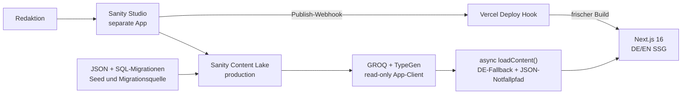

# Sanity-CMS — Umsetzungsplan (M19)

> **Stand:** 2026-08-06 · Umsetzung gestartet: lokale Phase-0-Inventur und Phase-1-Studio-Grundgerüst sind implementiert; Zielprojekt-/Account-Entscheidungen bleiben offen.
> **Ziel:** Der Bühnenverein pflegt Inhalte, Übersetzungen, Bilder, Termine, Partner und Rechtstexte selbst in einem eigenständigen Sanity Studio. Sanity löst nach geprüfter Datenparität die derzeitige Mischung aus statischen JSON-Dateien und dem nicht mehr erreichbaren Supabase-Projekt als redaktionelle Quelle ab.

## Kurzfassung

Wir übernehmen die tragenden Muster der `sina-schmidt-website`:

- eigenständiges Studio unter `studio/`, getrennt von der Next.js-App;
- ein gemeinsamer redaktioneller Datensatz für DE und EN mit DE-Fallback;
- Sanity als primäre Quelle hinter der bestehenden `loadContent()`-Naht;
- JSON-Bundles zunächst als Seed, Vergleichsbasis und Notfall-Fallback;
- Bilder als Sanity-Assets mit Alt-Text und Credit;
- geschützte Singletons für feste Seiten und Website-Einstellungen;
- `Publish` im Studio → Sanity-Webhook → Vercel-Deploy-Hook → frischer statischer Build;
- deploytes, login-geschütztes Studio für die Redakteur:innen.

Gegenüber Sina wird der Neubau an zwei Stellen verbessert:

1. GROQ-Queries werden mit `defineQuery` erfasst und per **Sanity TypeGen** typisiert; manuell gepflegte Raw-Query-Typen sind nicht die langfristige Quelle der Wahrheit.
2. Mehrsprachige Felder werden mit dem offiziellen Internationalized-Array-Pattern modelliert. Das behält den gewünschten gemeinsamen DE/EN-Workflow, vermeidet aber die Attribut-Aufblähung vieler `{de, en}`-Objekte.

## Umsetzungsstand (Session 41)

- ✅ Maschinenlesbarer Inventur-Snapshot unter `migration/reports/phase-0-inventory.json`: 47 lokale Quelldateien inklusive `routing.locales`, 12 DE/EN-Paare, 55 erwartete Erstimport-Dokumente und 21 redaktionelle Bildquellen. `pnpm cms:migrate`/`cms:verify` prüfen Dateien, Routing-Locales/Basissprache, Sollzahlen und tiefe Content-Parität, ohne Daten zu schreiben.
- ✅ `lc7slax2/production` geprüft: anonym lesbar (88 Inhaltsdokumente + 72 Bilder), aber mit dem aktuell gespeicherten Sanity-Konto nicht verwaltbar. Es bleibt reine Audit-/Migrationsquelle und wird nicht versehentlich als Zielprojekt verwendet.
- ✅ Eigenständiges `studio/` mit eigenem Lockfile, Structure Tool, Vision, Internationalized Arrays, statischen DE/EN-Sprachen, 11 geschützten Singletons, redaktionell gruppierter Navigation und Grundschemata für Personen, FAQ, Termine, Partner und Beiträge.
- ✅ Sanity-Schema, Studio-Typecheck/Lint/Build, TypeGen und der unveränderte Next.js-Build sind lokal grün; separater Studio-Job ist in der CI angelegt.
- ⏳ Offen für den Abschluss von Phase 0/1: bewusstes Sanity-Zielprojekt, Dataset-Sichtbarkeit, finaler Studio-Hostname, Editor:innen/Rollen und Vercel-Zugriff.
- ⏳ Phase 2 bleibt offen: seitenfachliche Abschnittsfelder über `intro`/`seo` hinaus vervollständigen und gegen alle JSON-/Message-Selektoren im Report abnehmen.

**Runtime-Grenze:** Das Projekt läuft auf Node 20.19. Sanity 6 erfordert inzwischen Node ≥22.12; deshalb ist das eigenständige Studio reproduzierbar auf Sanity `5.31.1` gepinnt und `autoUpdates` ist deaktiviert ([[ENTSCHEIDUNGEN#ADR-66]]). Ein Node-22-/Sanity-6-Upgrade wird separat geplant, nicht unbemerkt in M19 vermischt.

## Zielarchitektur

## Verbindliche Architekturentscheidungen für M19

### 1. Studio und Website bleiben getrennte Apps

Das Studio wird wie bei Sina als eigenständige App in `studio/` angelegt. Es erhält eine eigene `package.json`, eigene Dependencies und eine eigene TypeScript-Grenze. Der Root-Typecheck und der Vercel-Build der Website schließen `studio/` aus. Ein eingebettetes `/studio` im Next.js-Router ist nicht vorgesehen.

### 2. Sanity wird die redaktionelle Quelle der Wahrheit

Nach dem Cutover kommen veröffentlichte Inhalte aus Sanity. Die vorhandenen JSON-Dateien bleiben während der Migration unverändert als:

- Seed-Quelle für den Erstimport,
- Paritäts- und Audit-Grundlage,
- Rückfalloption, solange Sanity noch nicht vollständig live ist.

Es gibt danach keine dauerhafte manuelle Doppelpflege. Vor dem finalen Umschalten wird ein geprüfter Snapshot des veröffentlichten Sanity-Stands erzeugt beziehungsweise die Seed-Basis als dokumentierter Notfallstand eingefroren.

### 3. DE und EN teilen Dokument, Medien und Reihenfolge

Für dieses Projekt ist Field-Level-Lokalisierung passend: DE und EN verwenden dieselben Bilder, Referenzen, Reihenfolgen, Daten und Veröffentlichungszeitpunkte. Lokalisierte Werte werden per Internationalized Array gepflegt; DE ist Basissprache und Frontend-Fallback. Die vorhandenen locale-präfixierten URLs und die `next-intl`-Routing-Map bleiben unverändert.

### 4. Feste Seiten bekommen feste redaktionelle Modelle

Es wird in M19 **kein freier Page Builder** eingeführt. Das aktuelle, getestete Layout bleibt Code. Das CMS pflegt semantische Inhalte wie Nutzen, Ablauf, Ressourcen, Reise-Stationen oder Zitate; keine Felder wie „lila Karte" oder „dreispaltig". Das senkt Redaktionsfehler und schützt Design, A11y und Animationen.

### 5. Publish baut die statische Website neu

Wie bei Sina ist der erste Produktionsweg ein Vercel-Deploy-Hook. Ein Sanity-Webhook für veröffentlichte Create/Update/Delete-Ereignisse stößt den Build an. Der zentrale Fetch-Helper erhält einen deployment-spezifischen Cache-Key, damit Vercel keinen alten Next-Fetch-Cache übernimmt. Erwartetes Redaktionsmodell: **Publish → etwa 1–2 Minuten → live**. GitHub bleibt bei reinen Inhaltsänderungen unverändert.

### 6. Supabase wird nach Parität aus dem Runtime-Pfad entfernt

Das verschwundene Supabase-Projekt wird nicht zusätzlich zu Sanity neu aufgebaut. Inhalte aus den SQL-Migrationen werden nach Sanity importiert. Erst wenn Events, Partner und Posts in Sanity vollständig verifiziert sind, werden Supabase-Client, Env-Gates und der alte Revalidate-Endpoint aus der App entfernt. `supabase/migrations/` bleibt zunächst als historische Importquelle erhalten.

## Geplantes Inhaltsmodell

| Sanity-Typ | Art | Heutige Quelle | Zweck |
|---|---|---|---|
| `siteSettings` | Singleton | `messages/{de,en}.json`, SEO-Helfer | Site-Name, Meta-Defaults, Navigation, Footer, globale UI-/A11y-Labels |
| `homePage` | Singleton | `messages.hero`, `landing.json` | Hero, Nutzen, Netzwerk, Comic, Video, Stakeholder, Pitch, Zitate, Trust-Logos |
| `conceptPage` | Singleton | `pages.projekt`, `projekt.json`, `timeline.*` | Page-Hero, Konzeptionsabschnitte, Zeitstrahl-Intro, fünf Reise-Stationen, Team-Referenzen |
| `technicalStandardsPage` | Singleton | `projekt-technische-standards.json` | Textabschnitte, Video/Comic, Datenfluss, Ressourcen |
| `semanticStandardsPage` | Singleton | `projekt-semantische-standards.json` | Textabschnitte und weiterführende Links |
| `joinPage` | Singleton | `beteiligung.json` | Beteiligungs-Pitch und CTAs |
| `useCasesPage` | Singleton | `beteiligung-anwendungsbeispiele.json` | Drei Anwendungsfälle |
| `contributePage` | Singleton | `beteiligung-mitwirkung.json` | Nutzen, Schritte, Umsetzung, Zitat, Karten-Copy |
| `materialsPage` | Singleton | `materialien.json` | Ressourcen und Folge-Links |
| `teamPage` | Singleton | `pages.team`, `team.json` | Seitenintro und sortierte Referenzen auf Personen |
| `person` | Dokument | `team.json` | Name, Rolle, Portrait, Bühnenfoto, Quote, Credit; wiederverwendbar in Team/Konzeption |
| `faqCategory` | Dokument | `faq.json` | DE/EN-Label, stabiler Key, Reihenfolge |
| `faqItem` | Dokument | `faq.json`, historische SQL-Migration | Frage/Antwort als Rich Text, Kategorie-Referenz, Reihenfolge |
| `event` | Dokument | Supabase-Migrationen/Seed | Titel, Beschreibung, Zeitraum, Ort, Link, Status, Bild/Credit |
| `partner` | Dokument | Supabase-Migrationen/Seed | Name, Status, Koordinaten, Website, Logo |
| `post` | Dokument | Supabase-Migrationen/Seed | Slug, Titel, Excerpt, Body, Datum, Cover; erhält bestehende Detailroute/Sitemap |
| `legal` | Singleton | `legal.json`, später Auftraggebertexte | Impressum und Datenschutz als strukturierter Rich Text; leer bleibt sichtbarer TODO-Zustand |
| `locale` | Admin-Dokument | `routing.locales` | Deutsch/Englisch, Basissprache und Fallback für Studio-Plugins |

### Gemeinsame Objekttypen

- `localizedString`, `localizedText`, `localizedPortableText`
- `imageWithMetadata` mit Asset, lokalisiertem Alt-Text, Credit und optionaler Caption
- `internalOrExternalLink` mit klarer Linkart und bedingten Feldern
- `seo` für Seitentitel, Beschreibung und optionales Social Image
- semantische Abschnittsobjekte wie `textSection`, `resourceItem`, `journeyStation`, `quoteItem`

Normale Dokumente lassen Sanity ihre `_id` generieren. Deterministische IDs werden nur für Studio-Singletons verwendet. Importierte Quellidentitäten liegen bei Bedarf in `legacyId`/`sourceKey`, nicht in der `_id`.

## Umsetzung in neun Phasen

### Phase 0 — Voraussetzungen, Inventur und Sicherheitsnetz

**Arbeit**

- Sanity-Projekt im richtigen Account anlegen oder vorhandenes Projekt bewusst auswählen.
- Dataset `production`, Studio-Hostname und Redakteur:innen festlegen.
- Empfehlung: veröffentlichte Inhalte dürfen für die öffentliche Website anonym lesbar sein; Write-Token bleibt ausschließlich lokal/CI. Ein Read-Token wird erst für private Datasets oder spätere Draft Preview benötigt.
- ✅ JSON-, Message-, Asset- und SQL-Inventur als maschinenlesbaren Migrationsreport festhalten.
- ✅ Prüfen, ob das alte Sanity-Projekt `lc7slax2` nur CDN-Quelle ist oder zugänglich/übertragbar ist. Ergebnis: anonym lesbare Content-/Asset-Quelle, aber im aktuellen Konto nicht verwaltbar.

**Akzeptanz**

- Projekt-ID, Dataset, Studio-Hostname, Dataset-Sichtbarkeit und Editor-E-Mails sind dokumentiert.
- Kein Secret liegt in Git oder im Vault.
- Für jede heutige Inhaltsquelle existiert ein Zieltyp aus der Tabelle oben.

### Phase 1 — Eigenständiges Studio scaffolden

**Arbeit**

- `studio/` als Sanity-Studio mit TypeScript anlegen.
- Structure Tool, Vision, Internationalized Array und Icons einrichten.
- Singletons in der Desk-Struktur fest verdrahten; Create/Delete/Duplicate für sie sperren.
- Root-`tsconfig.json`, ESLint, Vercel und CI so begrenzen, dass das Studio eine eigene App bleibt.
- Root-Scripts für `cms:dev`, `cms:validate`, `cms:typegen`, `cms:migrate`, `cms:verify` ergänzen.

**Akzeptanz**

- Next-App und Studio starten getrennt.
- `sanity schemas validate` ist grün (aktueller kanonischer CLI-Befehl).
- Ein normaler Vercel-Build installiert keine Studio-Dependencies und typecheckt nicht versehentlich `studio/`.

### Phase 2 — Schema und Redaktionsoberfläche bauen

**Arbeit**

- Gemeinsame lokalisierte Felder, Rich Text, Bilder, Links und SEO modellieren.
- Dokumenttypen und Singletons aus dem Inhaltsmodell implementieren.
- Pflichtfelder, URL-/Slug-/Datumsvalidierung, Alt-Text-/Credit-Warnungen und Cross-Field-Regeln ergänzen.
- Studio-Navigation nach redaktioneller Aufgabe gruppieren: Seiten, Team, FAQ, Termine, Partner, Beiträge, Rechtliches, Einstellungen.
- Preview-Titel und Icons für alle Typen ergänzen.

**Akzeptanz**

- Redakteur:innen sehen keine technischen `_type`-Listen als Hauptnavigation.
- Alle derzeitigen JSON-/SQL-Felder sind ohne Layoutbegriffe abbildbar.
- Fehlende DE-Pflichtinhalte blockieren Publish; fehlende EN-Inhalte geben einen klaren Hinweis und nutzen im Frontend DE-Fallback.

### Phase 3 — Typsichere Next.js-Anbindung

**Arbeit**

- `@sanity/client`, Bild-URL-Builder, Portable-Text-Renderer und GROQ-Helfer ergänzen.
- Alle Queries mit eindeutigen `defineQuery`-Namen anlegen.
- `sanity schemas extract --enforce-required-fields` + `sanity typegen generate` als wiederholbaren Workflow und CI-Gate einrichten; generierte Typen committen.
- Einen zentralen read-only Fetch-Helper mit `perspective: published`, Fehlerprotokollierung und deployment-spezifischem Cache-Key bauen.
- `loadContent()` async machen: zuerst Sanity, dann nur bei fehlenden/fehlerhaften Daten JSON-Fallback.
- `next/image` für das neue Sanity-CDN konfigurieren; Crop/Hotspot, Dimensionen, Alt-Text und Credits erhalten.

**Akzeptanz**

- Keine Page greift direkt auf den Sanity-Client zu; alle Inhalte laufen durch Query/Mapper/Loader.
- TypeGen erkennt jede produktive Query.
- Build ohne Sanity-Env bleibt über Fallback möglich; Build mit Sanity-Daten nutzt nachweislich keinen JSON-Pfad.

### Phase 4 — Verlustfreie Migration und Readback

**Arbeit**

- Idempotentes Migrationsscript für JSON, Messages und Supabase-SQL erstellen.
- Medien aus `public/` und den alten `cdn.sanity.io/images/lc7slax2/...`-Quellen hochladen und Asset-Referenzen statt Hotlinks speichern.
- Migration zuerst im Dry Run: Anzahl Dokumente, Übersetzungen, Assets, Links und fehlende Pflichtfelder ausgeben.
- Danach batchweise schreiben; bestehende Studio-Edits nie durch unbedachtes `createOrReplace` überschreiben.
- Separates Verify-Script liest anonym veröffentlichte Daten zurück und vergleicht Anzahl, stabile Keys, Bilder, Links und DE/EN-Parität.

**Sollzahlen vor dem Cutover**

- 11 Singletons insgesamt: 9 feste Seiten plus `siteSettings` und `legal`
- 4 Personen
- 21 FAQ-Einträge in 4 Kategorien
- 4 historische Events aus M11 plus weitere im SQL-Seed vorhandene Datensätze
- 4 bekannte Kernpartner plus alle weiteren verifizierbaren Partnerzeilen
- 3 historische Post-Datensätze inklusive DE/EN-Texten, soweit in Migration/Seed vorhanden
- alle heute verwendeten redaktionellen Bilder mit Alt-Text/Credit-Feld

### Phase 5 — Frontend seitenweise umschalten

**Reihenfolge**

1. `siteSettings` und Startseite
2. Konzeption + technische/semantische Standards
3. Jetzt mitmachen + Anwendungsbeispiele + Mitwirkung + Materialien
4. Team und FAQ
5. Events, Partner und Blog/Sitemap
6. Rechtstexte

Nach jedem Paket werden DE und EN gegen den bisherigen Renderstand verglichen. Komponenten, Layout, Animationen und Routing bleiben unverändert; nur die Inhaltsquelle wechselt.

**Akzeptanz**

- Kein Text-, Link-, Bild-, Credit- oder Reihenfolgenverlust.
- FAQ-JSON-LD, Sitemap, per-Post-OG und `generateStaticParams` lesen aus Sanity.
- Leere Sammlungen zeigen einen ehrlichen Zustand, aber nicht unbemerkt die alte JSON-Version, wenn Sanity nur teilweise migriert ist.

### Phase 6 — Publish-to-Production und Studio-Deploy

**Arbeit**

- Vercel Deploy Hook auf `main` anlegen.
- Sanity-Webhook für veröffentlichte Create/Update/Delete-Ereignisse einrichten; Draft-IDs ausschließen.
- Hook-URL nur zwischen Dashboards übertragen, nie in Git/Vault speichern.
- Studio auf einen festgelegten `*.sanity.studio`-Hostname deployen.
- CORS für localhost, Vercel-Alias und spätere Custom-Domain setzen.

**Akzeptanz**

- Teständerung publizieren → neuer Vercel-Deploy → DE/EN live aktualisiert.
- Teständerung zurücknehmen → zweiter sauberer Deploy.
- GitHub-HEAD bleibt bei reinen CMS-Änderungen unverändert.
- Studio ist login-geschützt und für die eingeladenen Redakteur:innen erreichbar.

### Phase 7 — Qualitätsgates und Produktionsabnahme

Pflichtchecks:

- `sanity schemas validate`
- TypeGen ohne Diff nach erneutem Lauf
- Migrations-Dry-Run und vollständiger Readback
- `pnpm typecheck`, `pnpm lint`, `pnpm build`
- DE/EN-Smokes für alle Routen, 404, Sitemap, Robots und OG-Bilder
- Mobile 375 px, Tastatur/Fokus, Reduced Motion, keine Console-Fehler
- SEO- und JSON-LD-Parität
- Bild-Hotspots, Credits, Alt-Texte und Remote-Patterns
- Publish→Deploy-Endtest gegen Production

### Phase 8 — Supabase-Runtime kontrolliert stilllegen

Erst nach grüner Phase 7:

- `src/lib/supabase/`, `src/types/database.ts` und alte Runtime-Gates entfernen;
- `@supabase/ssr`, `@supabase/supabase-js` und die CLI entfernen, falls keine andere Funktion sie benötigt;
- alten `/api/revalidate`-Endpoint und Supabase-Env-Dokumentation entfernen/ersetzen;
- `supabase/migrations/` als historische Quelle zunächst behalten und im Vault als archiviert markieren;
- Vercel-Env-Variablen erst löschen, nachdem ein Build ohne sie produktiv verifiziert wurde.

### Phase 9 — Redaktioneller Handoff

- Redakteur:innen einladen und Rollen prüfen.
- Kurzanleitung schreiben: Login, DE/EN-Felder, Bilder/Alt/Credit, Draft, Preview-Status, Publish, erwartete Deploy-Dauer.
- Backup-/Export-Runbook und Token-Rotation dokumentieren.
- Studio-Link und Verantwortlichkeiten im Vault/Go-live-Handbuch hinterlegen.
- Optional danach: Presentation Tool/Visual Editing und Draft Preview als eigenes, nicht go-live-kritisches Paket.

## Rollback-Strategie

- Bis zum endgültigen Cutover bleiben JSON und Supabase-Code unverändert im Repo.
- Jede Frontend-Phase wird separat commitbar und rückrollbar umgesetzt.
- Der Loader-Fallback verhindert einen Build-Ausfall, darf aber fehlende Migrationen nicht verschleiern; Verify-Script und Produktions-Smokes sind deshalb Pflicht.
- Supabase-Code/Dependencies werden erst entfernt, wenn Sanity-Readback und Production-Deploy vollständig bewiesen sind.
- Secrets werden niemals als Migrationsdaten oder Vault-Inhalt gespeichert.

## Nicht Teil von M19 v1

- freier Page Builder oder Layout-Editor;
- redaktionelle Änderung von Design-Tokens, Animationen oder Komponentenreihenfolge außerhalb vorgesehener Listen;
- Kontaktformular/Newsletter/CRM;
- automatische KI-Übersetzung;
- Visual Editing/Presentation Tool (als optionales Folgepaket vorgesehen);
- DNS-Umstellung der Custom-Domain.

## Entscheidungen/Aktionen, die der User für den Abschluss von Phase 0/1 liefern muss

1. Sanity-Projekt neu anlegen oder Projektzugang bereitstellen; empfohlen ist ein projektbezogenes Konto/Team, nicht ein persönlicher Fremdaccount.
2. Gewünschter Studio-Hostname, z. B. `smarte-theaterdienste`.
3. E-Mail-Adressen der Redakteur:innen und gewünschte Rollen.
4. Bestätigung: veröffentlichtes Dataset öffentlich lesbar (empfohlen für diese rein öffentliche Website) oder privat mit Vercel-Read-Token.
5. Vercel-Zugriff für Deploy Hook und Production-Env.

## Definition of Done

M19 ist abgeschlossen, wenn:

- alle gelisteten Inhalte in Sanity pflegbar und aus `production` lesbar sind;
- DE und EN ohne Inhaltsverlust aus Sanity rendern;
- JSON nur noch dokumentierter Seed/Notfallpfad ist;
- Events, Partner und Posts nicht mehr von Supabase abhängen;
- Schema, TypeGen, Migration, Readback, Typecheck, Lint und Build grün sind;
- ein echter Studio-Publish die Production-Site innerhalb des vereinbarten Fensters aktualisiert;
- Studio deployt, Redakteur:innen eingeladen und das Pflege-Runbook übergeben sind;
- Supabase-Runtime erst danach sauber entfernt wurde.
