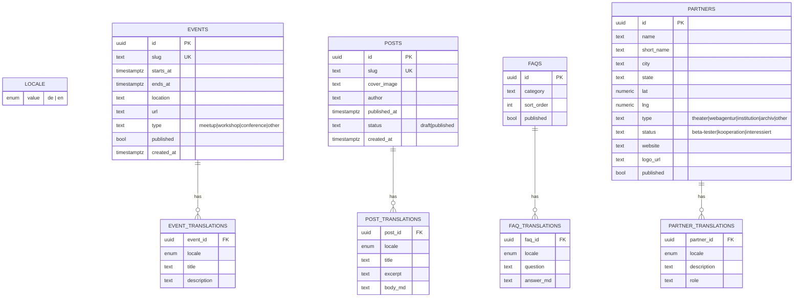

# Datenbank ER-Diagramm

Pattern: Parent-Tabelle für Daten, separate `*_translations`-Tabelle pro Locale.

## RLS-Policies (Skizze)

- Alle Parent-Tabellen: `select` wenn `published = true`
- Translations: `select` immer (auf Parent-Sicht filtert sich's automatisch via Join)
- `insert/update/delete`: nur `service_role`

## Statisch im Code (kein DB)

- **Ansprechpersonen** (4 Personen) → `src/content/{locale}/team.json`
- **Static Marketing-Texte** (Standards, Anwendungsbeispiele) → `src/content/{locale}/*.mdx`
